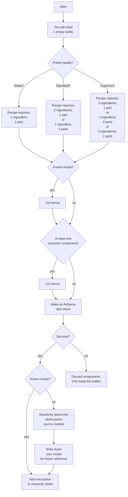

# Brewing a Potion

Todo: Add supporting documentation, page references etc.  This was the first shot at 'em, so became more verbose as I went.

```mermaid
flowchart TD
    A[Start] --> B[You will need<br>1 empty bottle]
    B --> C{Potion quality?}
    C -->|Weak?| D[Recipe requires:<br>1 ingredient<br>1 part]
    C -->|Standard?| E[Recipe requires:<br>2 ingredients,<br>1 part<br>or<br>1 ingredient,<br>2 parts]
    C -->|Supreme?| F[Recipe requires:<br>3 ingredients,<br>1 part<br>or<br>1 ingredient,<br>3 parts<br>or<br>2 ingredients,<br>2 parts]
    
    D --> G{Known recipe?}
    E --> G
    F --> G

    G -->|yes| H[+10 bonus]
    H --> I
    G -->|no| I{At least one<br>exquisite component?}
    
    I -->|yes| HH[+10 bonus]
    HH --> J
    I -->|no| J[Make an Alchemy<br>skill check]
    
    
    J --> K{Success?}

    K -->|yes| M{Known recipe?}
    K -->|no| L["Discard components.<br>(You keep the bottle)"]
    

    M -->|yes| N[Add new potion<br>to character sheet]
    M -->|no| O[Randomly determine<br>which potion<br>you've created]
    
    O --> P[Write down<br>your recipe<br>for future reference]
    P --> N
```