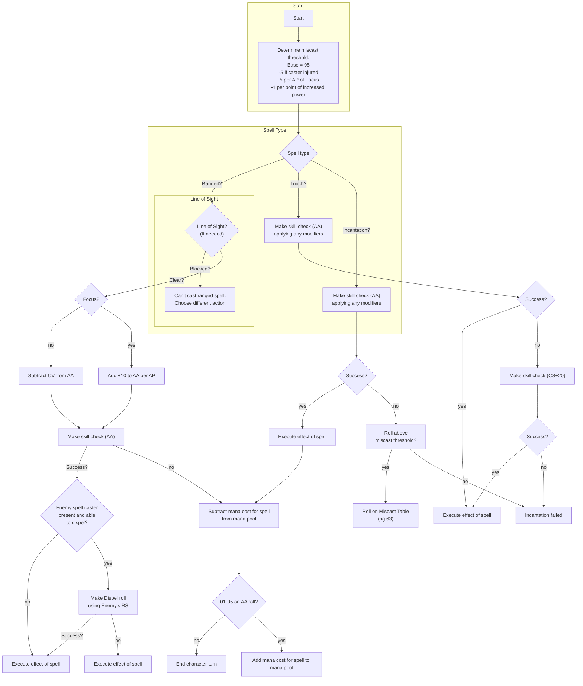

```mermaid
flowchart TD
    subgraph Start
    A["Start"] --> B["Determine miscast threshold:
Base = 95
-5 if caster injured
-5 per AP of Focus
-1 per point of increased power"]
end
subgraph Spell Type
    C{"Spell type"}
    B --> C
    C -->|"Ranged?"|D 
    subgraph Line of Sight
    D{"Line of Sight?<br>(If needed)"}
    D -->|"Blocked?"| G["Can't cast ranged spell.<br>Choose different action"]
    end
    C -->|"Touch?"| E["Make skill check (AA)<br>applying any modifiers"]
    C -->|"Incantation?"| F["Make skill check (AA)<br>applying any modifiers"]
end

    D -->|"Clear?"| H{"Focus?"}
    
    H -->|"no"| I["Subtract CV from AA"]
    H -->|"yes"| J["Add +10 to AA per AP"]
    
    I --> K["Make skill check (AA)"]
    J --> K
    
    K -->|"Success?"| L{"Enemy spell caster<br>present and able<br>to dispel?"}
    K -->|"no"| M["Subtract mana cost for spell<br>from mana pool"]
    
    L -->|"no"| N["Execute effect of spell"]
    L -->|"yes"| O["Make Dispel roll<br>using Enemy's RS"]
    
    O -->|"Success?"| N
    O -->|"no"| P["Execute effect of spell"]
    
    E --> Q{"Success?"}
    Q -->|"yes"| R["Execute effect of spell"]
    Q -->|"no"| S["Make skill check (CS+20)"]
    
    S --> T{"Success?"}
    T -->|"yes"| R
    T -->|"no"| U["Incantation failed"]
    
    F --> V{"Success?"}
    V -->|"yes"| W["Execute effect of spell"]
    V -->|"no"| X["Roll above<br>miscast threshold?"]
    
    X -->|"yes"| Y["Roll on Miscast Table<br>(pg 63)"]
    X -->|"no"| U
    
    M --> Z{"01-05 on AA roll?"}
    Z -->|"no"| M2["End character turn"]
    Z -->|"yes"| M3["Add mana cost for spell to mana pool"]
    
    W --> M


```