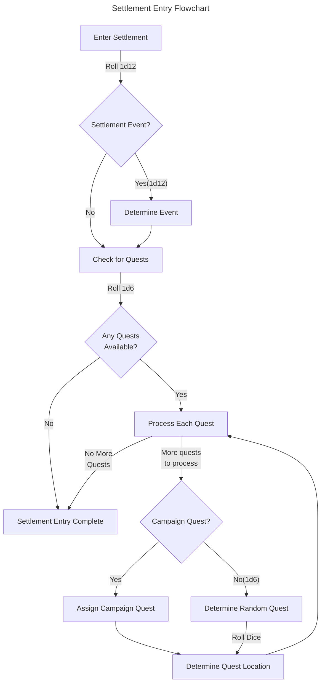

# Settlement Entry

add side quests table

Entering settlements result in quite a few dicerolls being required.  This is bringing them together to reduce the hunting through the absolute maze of a sourcebook.

## Settlement Events

Just like when on the road, events can trigger in town.

### Check if there is an event (Page 130)

Whenever the party enters a settlement, they must roll for a random Event. Roll 1d12 and consult the table to see if you have triggered an Event. If that is the case, roll on the Events Table and follow the instructions.

| Settlement  | Event on |
|-------------|:--------:|
| Birnheim    | 11-12    |
| Caelkirk    | 10-12    |
| Coalfell    | 11-12    |
| Durburim    | 11-12    |
| Freyfell    | 10-12    |
| Irondale    | 11-12    |
| Rochdale    | 11-12    |
| Silver City | 8-12     |
| Whiteport   | 9-12     |
| The Outpost | 9-12     |
| Windfair    | 11-12    |

### Determine which event triggers (Page 133)

If there is an event, 1d12 to figure out which one will be triggered. 

| 1d12 | Event |
|:----:|---------|
| 1    | Stray dog. The party is followed through the streets by a stray dog. After receiving a small treat from one of the heroes, it seems that you now are the proud owners of a dog. Randomise what kind of dog, using the Companions’ Compendium. If you do not own this compendium, or if you already have a dog, treat this result as: ‘Nothing special happens’. |
| 2    | Scrolls Salesman. The heroes are approached by a man who sells magic scrolls. Randomise three spells that are available. Each scroll cost 100 c. |
| 3    | Potion Salesman. A man clad in purple robes informs the party that he sells premium potions. Use the Potions Table with an availability of 4 for every potion regardless of class, and -20 c as a price modifier. |
| 4    | Trinket Salesman. This old man claims to be selling magic trinkets. Most of the things he carries around seem quite plain and ordinary, but some of them do have a special feel to them. He charges 100 c for each trinket, but you are only allowed to buy 1 per hero. For each trinket bought, roll 1d12. On a result of 1-5, it is magic. A result of 5-11 means the trinket is useless and cannot even be sold. A result of 12 means you have bought a cursed item. For any magic trinkets, roll on the Magic Items Table. For cursed trinkets, roll on the Curses Table. The unaware hero must wear the trinket until he or she exits the next dungeon before it can be thrown away. In all cases, decide whether the trinket is a ring or necklace. |
| 5    | Sale! There seems to be a settlement-wide sale going on. All stores sell their items at a 20% discount. |
| 6    | Fresh Stocks. All stores have just been restocked and there is plenty to choose from. All availabilities are modified by +2. If this results in 6, the item is maximally in stock. |
| 7    | Settlement Feast. There is a celebration in the settlement and there are people everywhere. If you stay the night, the good mood of the citizens boosts Party Morale temporarily by +2 (which can go above PM max). It stays at +2 until lowered by natural means and can then only be raised back to the standard level. However, the huge amount of people means that most beds at the inns are taken. On a result of 9-12 on 1d12, there are no beds, and the party must continue their travel without doing any business (you may claim any quest reward before leaving). |
| 8    | Side Quest. The party is approached by a citizen, urgently requesting their help. Roll on the Side Quest Table and decide if you wish to add this to your current quest. |
| 9    | Shortage of Goods. The settlement has not had any trade caravans passing by for weeks, and the stores are nearly empty. All availabilities are modified by -2. If this results in 0, the item is automatically out of stock. As a result, prices have also gone up, resulting in a +10% price modifier on all items. |
| 10   | Thief. The party realizes that a pickpocket has managed to get too close. 1d100 c have been stolen. |
| 11   | Assassination attempt. It seems someone is holding a grudge against the heroes. Randomize one hero that is attacked by 1d4 bandits. Randomize each bandits’ weapon by using the enemy equipment cards. Bandits with ranged weapons will also have daggers. Use the city tile and place the heroes along one board edge and the bandits along the opposite edge. The battle ends when all bandits are dead or all heroes have dropped to 0 HP. The heroes do not die, but instead be nursed back to 1 HP by the locals. The bandits may be searched. |
| 12   | Curse! While walking down the street, a gnarly old woman suddenly points her finger at the party and screams: “Heretics! I curse thee!”. Roll on the Curses Table once and apply the curse to all heroes until they exit the next dungeon. |

## Available Quests (Page 131)

Other than just re-supply in town, you can seek out quests if available.

### Check if there is quests available

Roll **1d6** on the table to see what quests are
available. If there is a quest available, then roll
**1d8**. On a result of 1-2 on the d8, a side quest
is available as well and may be taken together
with any of the other quests. See page 271.
Luck may not be used for any of these two rolls.
Use the Quest Book tables to generate which
quests to choose from. If none of the quests are
interesting to the party, they must move to
another settlement to find new ones.

#### Main quests

| 1d6  | Settlement | Silver City |
|------|:----------:|:-----------:|
| 1    | 2 quests   | 3 quests    |
| 2-4  | 1 quest    | 2 quests    |
| 5    | -          | 1 quest     |
| 6    | -          | -           |

#### Side quests (Page 271)

Side quests are additional objectives added to an existing main quest the party is participating in.

| 1d6 | Quest               | Page |
|----:|---------------------|-----:|
|  1  | The Missing Brother | 272  |
|  2  | Slay the Beast      | 273  |
|  3  | The Mapmaker        | 274  |
|  4  | Go Fetch!           | 275  |
|  5  | Manhunt             | 276  |
|  6  | Mushrooms           | 277  |

### Which quest/s?  (Page 220/241)

The party can choose to embark/continue on the campaign, or they can choose a random quest.

#### Campaign quest (Page 220)

When you do have a quest available, the campaign is available at page 220.  

#### Random Quest (Page 241)

To embark on a Random Quest, you must first roll on the table below to determine the Objective Room. Once that is determined, consult the corresponding chapter and roll which quest to embark upon. These quests can be played over and over as the layout of the dungeons shifts and the difficulty increases as the heroes gain levels.

| 1d6 | Objective room             | Number of  quests | Page | 
|-----|----------------------------|:----------------:|------|
| 1   | The Lava River             | 3                | 242  |
| 2   | The Bandits’ Hideout       | 2                | 247  |
| 3   | The Fountain Room          | 2                | 251  |
| 4   | The Great Crypt            | 3                | 257  |
| 5   | The Chamber of Reverence   | 3                | 253  |
| 6   | Roll Again                 |||

### Where are the quests located? (Page 130)

The Quest Site is determined by rolling a dice and cross-referencing this to the numbers written on the map. The smaller settlements will have quests in close proximity, since their inhabitants seldom have business across the Kingdom. The largest city in the area, Silver City, attracts visitorsfrom all over the Kingdom. Therefore, the Quest Sites are far more dispersed. **The only settlement to offer quests in the Ancient Lands is The Outpost.**

| Settlement  | Quest dice | Colour  |
|-------------|------------|---------|
| Caelkirk    | 1d4        | Red     |
| Coalfell    | 1d6        | Green   |
| Freyfell    | 1d6        | Pink    |
| Irondale    | 1d6        | Turqois |
| Rochdale    | 1d6        | Purple  |
| Silver City | 2d20       | White   |
| The Outpost | 1d12       | Yellow  |
| Windfair    | 1d6        | Blue    |
| Whiteport   | 1d6        | Black   |

## Quick Reference Flowchart

