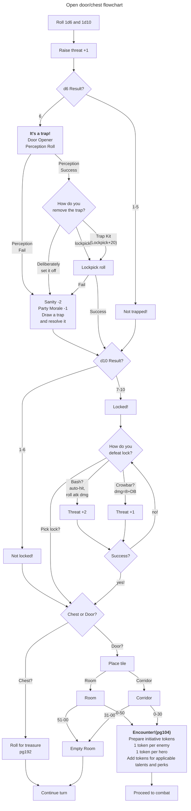

# Check door/chest

## Opening a door or Chest (pg99)
Opening a door or chest costs 1 Action Point and requires the model to be adjacent to the door or chest. Perform the following steps:

1. Increase the Threat Level by 1.
2. Roll 1d10 and 1d6 simultaneously. If the d6 ends up a 6, the door or chest is trapped. Draw a trap card. Resolve thetrap (if any), then check the Door Table to see if it is locked. See ‘Locked’ below.
3. Once a door is unlocked, flip the top card, and place the corresponding new section. If it is a chest, roll on the Furniture Treasure Table to learn what it contains.
4. In case of a door, roll to see if there are any enemies inside the room. See ‘Encounters’ and ‘Placing Enemies’ on page 104.

### Traps in Doors and Chests

If the door or chest is trapped, the hero attempting to open must make a Perception Roll (modified by applicable Talents and the modifier mentioned on the card next to the eye). If you succeed, the trap has been discovered without setting it off. It can now be disarmed or deliberately set off (2 AP). The modifier next to the cogs is applied to the disarm roll. The door/chest is opened as part of the action. If you fail to disarm the trap or deliberately set if off, you suffer the consequences. A detected Mimic left alone will not fight. Some traps might affect others than the individual setting it off. Unless otherwise noted, there are no saving throws of any kind for those affected. Remember that setting a trap off this affects the psychology of the group and the individual.

**Note** Triggering traps inflicts a -2 Sanity(pg53) and -1 Party Morale(pg56). 

### Locked
If the door or chest is locked, you can try to force it open. It takes 1 Action Point, and you automatically damage the door/chest with whatever attack you make. Once the door/chest reaches 0 HP it is opened. However, every try you make will reverberate throughout the dungeon, making your presence known to those who are listening. Add +2 Threat Level for each attempt. Another option is to use a crowbar. A crowbar will increase the Threat Level +1, but only inflicts 8+DB Damage every turn.

You could also try to pick the lock which takes 2 AP but does not increase the threat any further no matter how many times you try. If the attempt succeeds, the door is opened as a part of those 2 Action Points. Remember that if you fail, the pick breaks. If you fumble when picking, the lock is jammed and the only way to open the door is to break it down.

| 1d10 | Door/Chest | Difficulty           |
|------|------------|----------------------|
| 1-6  | Unlocked   | -                    |
| 7    | Locked     | Pick lock: 0, HP 10  |
| 8    | Locked     | Pick lock: -10, HP 15|
| 9    | Locked     | Pick lock: -15, HP 20|
| 0    | Locked     | Pick lock: -20, HP 25|

### Closing a door

Doors can be closed by spending 1 AP.

## Relevant skills (pg26)
**Pick Locks (DEX)** - This skill is used to open locked doors, chests, and also to disarm traps. Make a roll using the applicable modifiers. To open locks, you need a 10</|end_of_text|lock pick. The lock pick is consumed if you fail, and you may try as many times as you have picks. Each attempt takes 2 actions. Disarming a trap can also be done using a lock pick, or a trap disarming kit at a cost of 2 AP. If you fail, you have set off the trap, and the lock pick breaks. Trap disarming kits do not break due to a failed attempt.

**Perception (WIS)** - Perception is used to notice important details, like traps, or to find clues which will help you to solve riddles. It is also used while searching. This may be done once by the party on each tile.

## Searching a Chest (Pg 192)
Once it's open, you may search it.

| Roll (1d10) | Result                |
|-------------|-----------------------|
| 1           | 1 Wonderful Treasure  |
| 2-4         | 2 Fine Treasures      |
| 5-8         | 1 Fine Treasure       |
| 9-10        | Nothing               |

## Quick Reference Flowchart

